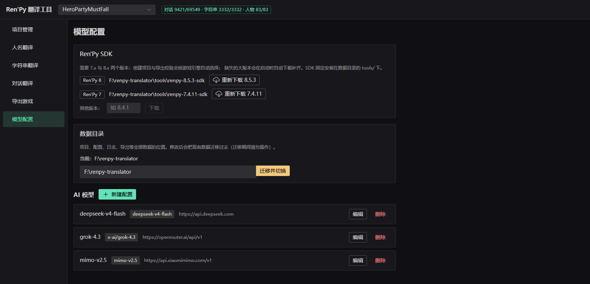
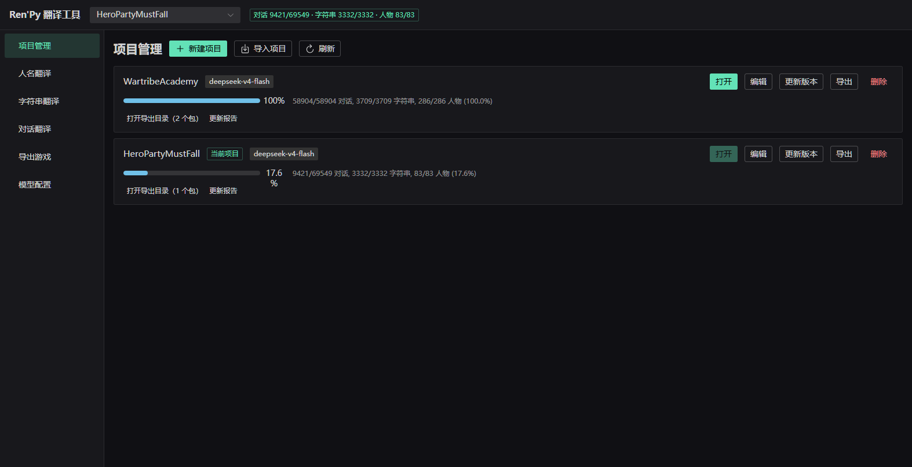
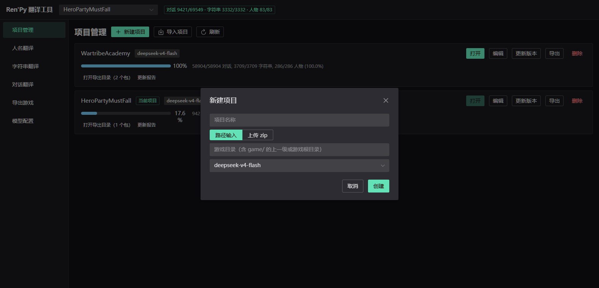
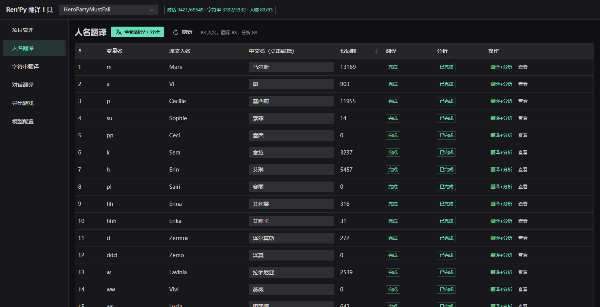
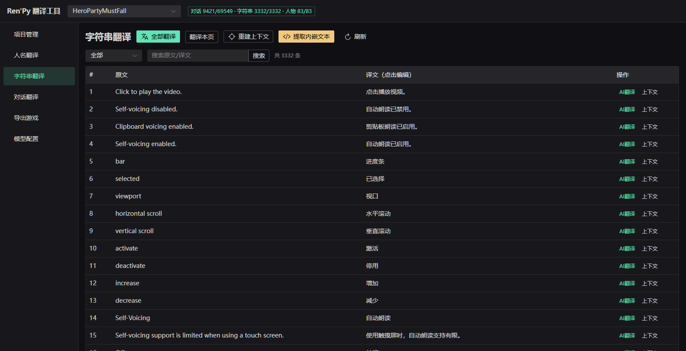
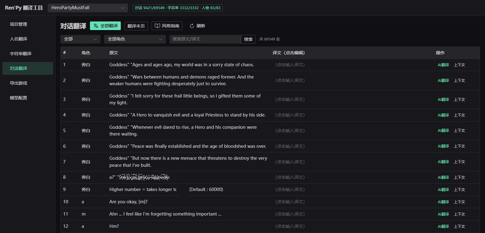
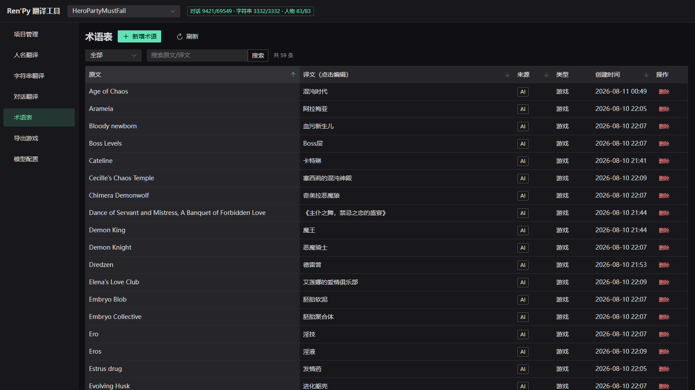
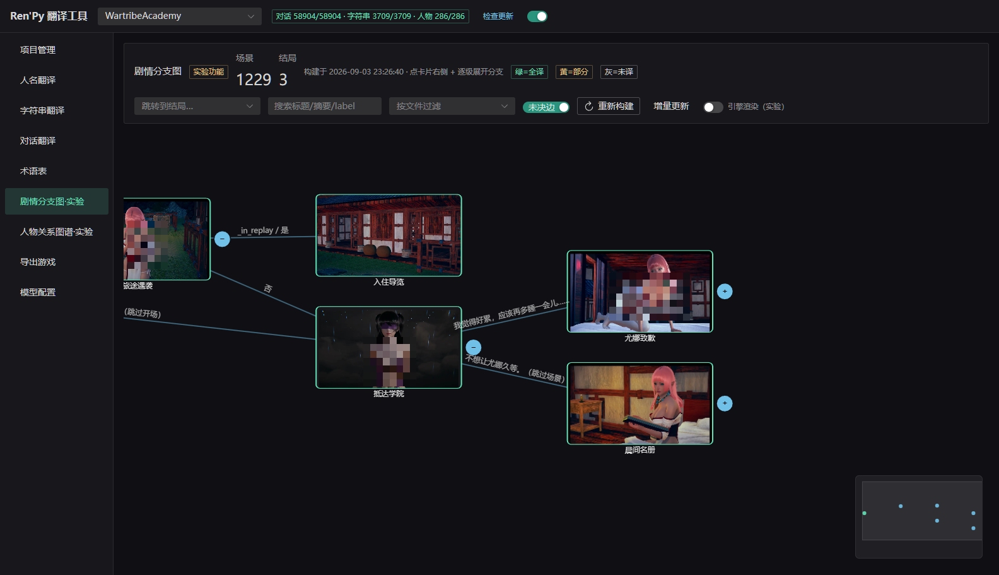
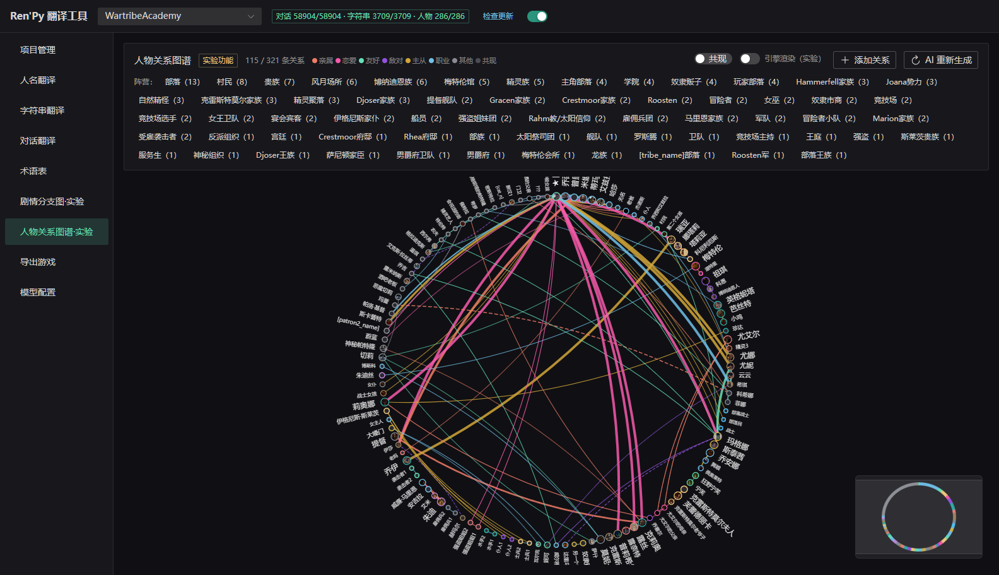
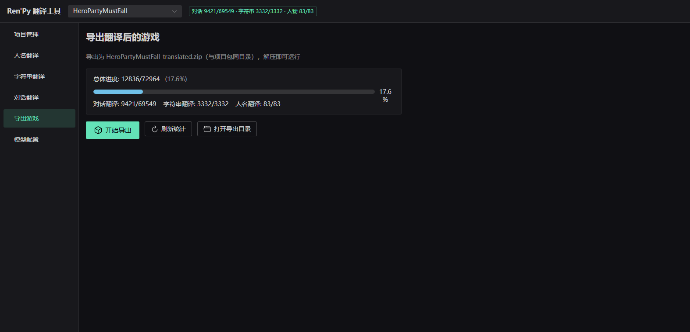

# Ren'Py 翻译工具 · 界面介绍与使用说明

本文按界面逐页介绍工具功能与完整使用流程。截图取自真实项目（深色主题）。

## 界面总览

启动后驻系统托盘（托盘菜单：打开界面 / 用浏览器打开 / 退出服务）。
界面为 Web UI，关窗、关浏览器都**不会中断**正在运行的任务。

整体布局：

- **顶栏**：当前项目下拉框（可快速切换/关闭项目）+ 实时进度统计
  （`对话 9421/69549 · 字符串 3332/3332 · 人物 83/83`）+「检查更新」按钮
  （旁带开关：启动时自动检查，有新版本才弹窗，失败/无更新静默）
- **左侧菜单**：项目管理 / 人名翻译 / 字符串翻译 / 对话翻译 / 术语表 /
  剧情分支图·实验 / 人物关系图谱·实验 / 导出游戏 / 模型配置
- **主区域**：各功能页面

长任务（建项、批量翻译、导出）在后台执行，弹出进度对话框带实时日志；
刷新页面或重开浏览器会自动重连回放进度。任务全程可取消，重复点击同类任务不会并发执行。

---

## 1. 模型配置（首次使用先来这里）



首次使用按顺序完成两项配置：

1. **Ren'Py SDK**：需要 7.x 与 8.x 两个大版本（按游戏引擎自动选择），
   点「重新下载」即可应用内一键下载；也可在「其他版本」输入版本号（如 `8.4.1`）下载指定版本。
   SDK 固定安装在数据目录的 `tools/` 下。
2. **AI 模型**：「新建配置」添加 OpenAI 兼容接口（DeepSeek、GPT、Claude、OpenRouter 等均可），
   填写名称、模型 ID、接口地址与 API Key。进阶参数：
   - **温度**：留空即不发送该参数，跟随模型默认
   - **思考模式**：三态——「跟随模型默认（不发参数）」/「开启」/「关闭」
     （DeepSeek V4 / GLM / 豆包等支持 thinking 参数；DeepSeek V4 默认即思考，
     要关掉须显式选「关闭」；接口不支持时「测试连接」会报 400，改回默认即可；
     开启时请加大 max_tokens——思考内容也占输出额度）

另有**数据目录**设置：项目、配置、日志、导出的存放位置。修改后会把现有数据整体迁移过去
（迁移期间请勿操作）。便携版数据在 exe 旁，整目录拷走即完成迁移。

---

## 2. 项目管理



项目卡片显示：项目名、所用模型、翻译进度条与明细（对话/字符串/人物）、
「打开导出目录」「更新报告」快捷入口。每张卡片的操作：

| 按钮 | 说明 |
|---|---|
| 打开 | 设为当前项目（顶栏随之切换） |
| 编辑 | 修改项目名 / 模型等 |
| 更新版本 | 游戏出了新版本后就地升级项目（见下文「版本更新」） |
| 导出 | 导出项目包（备份/迁移用，可在别的机器「导入项目」） |
| 删除 | 删除项目数据（不影响原游戏） |

### 新建项目



点「新建项目」，填项目名称，游戏来源二选一：

- **路径输入**：填游戏目录（含 `game/` 的上一级或游戏根目录）
- **上传 zip**：直接上传游戏压缩包

选择 AI 模型后点「创建」，后台自动完成：**解包 `.rpa` → 反编译 `.rpyc` →
检测引擎版本并匹配 SDK → 生成标准翻译模板 → 解析入库**。
期间若检测到游戏自带中文翻译会弹窗询问处理方式；rpyc-only 游戏缺少 unrpyc 时会提示安装方法。

> 反编译依赖：安装包已内置 unrpyc，开箱即用；便携/开发版需自行放置
> `tools/unrpyc/`（详见 README「反编译依赖」一节）。

---

## 3. 人名翻译（建议最先做）



建项后自动提取全部角色定义（含 DynamicCharacter、玩家可改名占位符）。

- 顶部支持**搜索**（原文人名/变量名/中文名）与**状态筛选**
  （全部/未翻译/已翻译/未分析）；「原文人名」「台词数」列头可点击排序
- 表格列：
  - **变量名**：脚本中的角色变量（如 `m`、`a`）
  - **原文人名 / 中文名**：中文名一列**点击后进入编辑**，Enter 或点别处即存
  - **台词数**：该角色的台词总量（可排序，主角优先精修）
  - **翻译 / 分析**：完成状态标记

操作：

- **全部翻译+分析**（推荐）：一次 AI 调用同时翻译人名 + 生成角色画像
  （性格、说话风格、翻译建议等）。人名译文和角色画像都会注入后续所有翻译，显著影响质量
- 每行「翻译+分析」可单独重跑；「查看」可看该角色的完整画像

---

## 4. 字符串翻译（菜单、按钮等 UI 文字）



- 顶部：**全部翻译** / **翻译本页** / **重建上下文** / **提取内嵌文本** / 刷新
- 筛选：全部 / 未翻译 / 已翻译；支持原文/译文搜索、分页；「原文」列头可点击排序
- 表格中**点击译文进入行内编辑**，Enter 或点别处即存
- 每行「AI翻译」单条重翻；「上下文」查看该条在源码中的位置

**提取内嵌文本**：扫描源码中没包 `_()` 的界面/脚本文本（如写死的按钮文字），
AI 预筛 + 人工复核（可查看源码上下文、单句精判、全部重判），确认后原位标记，
再由 SDK 重新生成模板入库翻译。

---

## 5. 对话翻译（主战场）



与字符串页类似，多了**按角色筛选**（配合人名页的台词数，先翻主角线）和**风格指南**入口；
「角色」「原文」列头可点击排序。

建议顺序：先完成人名翻译与风格指南，再批量翻对话。

- **风格指南**：可手写，也可让 AI 从台词抽样自动生成；翻译时全程注入，统一语气文风
- **批量翻译**：全部 / 本页两种粒度，随时可停止；中断后重发会**自动跳过已完成部分**
- 翻译时自动注入：术语表、人名表、角色特征、label 上下文、风格指南
- **上下文**：查看该句所属 label 与前后文，便于判断语气
- 行内点击译文精修，即改即存

---

## 6. 术语表



翻译过程中 AI 会自动积累术语（地名、怪物名、技能名等），本页集中管理，
翻译时全量注入 prompt，保证前后译名一致。

- **来源**：`AI`（翻译时自动添加）/ `手动`（本页新增），可按来源筛选
- **新增术语**：填原文（必填）、译文、类型（游戏术语 / UI 术语）
- **搜索**：按原文/译文模糊搜索；「原文」「译文」「来源」「创建时间」列头可点击排序
- **译文点击编辑**：发现 AI 译得不准的术语，点击直接改，后续翻译立即生效
- **删除**：带二次确认

---

## 7. 剧情分支图（实验功能）



> ⚠️ **实验功能未经完整验证，不能确保准确性**：剧情图由脚本静态解析 + AI 摘要生成，
> 复杂游戏的动态跳变（事件袋、程序化导航等）只能靠静态手段恢复，**结果可能与游戏
> 实际剧情不一致**（分支遗漏、场景错配、结局误判等）。本页仅供翻译时参考浏览，
> 请勿作为剧情事实依据。

静态解析游戏脚本，把剧情按场景组织成图谱：每个场景是一张卡片（AI 摘要标题、
场景缩略图、出场角色、翻译进度着色——绿=全译 / 黄=部分 / 灰=未译），卡片间连线
是剧情跳转。

操作：

- **构建剧情图**：静态解析 + AI 逐场景摘要 + 缩略图合成，首次构建较久；
  **重新构建**为全量重建（AI 重新分析），**增量更新**只补新增内容、不重跑 AI
- **逐级展开**：点卡片右侧 `+` 展开后续分支；**搜索**标题/摘要/label 命中时
  自动展开最短路径；**跳转到结局**下拉选中后图自动定位并展开路径
- **按文件过滤**（纯筛选）；**未决边**开关（静态解析无法确定的动态跳变边）
- **换缩略图**：每个场景有多帧候选，卡片上可手动挑选

**引擎渲染（实验）**：页面顶部开关（与人物关系图谱页共用，开一处两处生效）。
默认缩略图由 Pillow 合成（图像文件 + transform 静态近似）；开启后改用游戏自己的
Ren'Py 引擎在沙盒中逐场景回放渲染——真实 ATL 动画、layeredimage 分层立绘、
CG 渲染路径都能与游戏一致。

> ⚠️ **引擎渲染是实验性中的实验性功能，不能保证正常运行**：沙盒要在后台驱动游戏
> 引擎回放，深度定制初始化的游戏可能渲染失败或画面不完整。失败会**明确报错**
> （不静默回退）；关闭开关即回到 Pillow 合成，其余功能不受影响。

---

## 8. 人物关系图谱（实验功能）



> ⚠️ **实验功能未经完整验证，不能确保准确性**：关系由 AI 从台词推断，
> **可能与游戏实际人物关系不一致**（漏判、误判、立场偏差等），仅供参考。

- **AI 生成关系图谱**：AI 通读台词推断角色间关系，按类别图例着色；
  支持**阵营**标签筛选、**共现**边开关
- **AI 重新生成**会替换上次自动结果，**人工添加的关系保留**
- **添加关系**手动补充；点角色头像打开角色卡（立绘、台词数、关系列表），
  立绘头像可从候选中手动更换
- **引擎渲染（实验）**开关与剧情图页共用：开启后立绘由引擎沙盒渲染
  （同样属于实验性中的实验性功能，不能保证正常运行，失败明确报错）

---

## 9. 导出游戏



标题行即操作区：**开始导出** / 刷新 / 打开导出目录。
卡片显示总体进度，以及对话、字符串、人名三项各自的小进度条。

点「开始导出」一键完成：

1. 填充对话/字符串译文
2. 写入角色名 `translate python` 覆盖块
3. 注入中文字体（含 font_replacement_map 覆盖写死字体）
4. 添加语言选择入口
5. 用对应大版本 SDK 做**编译校验**，失败时 AI 自动修复（译文修复/内嵌拆除）
6. 反编译产生的 `.rpy` 自动移除，游戏运行原始 `.rpyc`

成品 zip 在 `exports/<项目名>/<项目名>-translated.zip`，解压即可运行；
页面上「打开导出目录」直达。

---

## 10. 版本更新（游戏出新版后）

在项目管理页点「更新版本」，选择新版游戏目录/zip，就地升级：

- 已有译文按原文**自动继承**
- 微改句子**模糊匹配预填** + 复核表人工确认
- 失效旧译文保留可查
- 更新中途失败/取消会**自动恢复到更新前状态**，不会留下半成品数据

---

## 推荐完整流程

```
模型配置（SDK + AI 模型）
   ↓
项目管理 → 新建项目（自动解包/反编译/入库）
   ↓
人名翻译 → 全部翻译+分析
   ↓
字符串翻译 → 全部翻译（必要时「提取内嵌文本」）
   ↓
对话翻译 → 风格指南 → 全部翻译 → 按角色/上下文精修
   ↓                ↘ 术语表：校对 AI 自动积累的译名
导出游戏 → 一键导出（含编译校验 + 自动修复）
```

剧情分支图 / 人物关系图谱是**辅助浏览工具（实验功能，未经完整验证，不能确保准确性）**，
可在任意阶段构建使用，不参与上面的翻译与导出主流程。

## 常见问题

- **关窗后任务还在吗？** 在。服务常驻后台，重开界面自动重连进度。
- **中断的批量翻译会重复扣费吗？** 不会。重发自动跳过已落库的条目。
- **同一个名词前后译得不一致？** 到「术语表」改成你想要的译名，后续翻译会统一使用。
- **换电脑/重装？** 便携版整目录拷走即可；或用项目管理的「导出/导入项目」。
- **翻译效果不好？** 优先检查：人名翻译+分析是否完成、风格指南是否生成、
  换用更强的模型（编辑项目可换模型）。
- **剧情图/关系图和实际剧情对不上？** 两图均为实验功能，未经完整验证：静态解析
  恢复不了所有动态跳变，AI 摘要与关系推断也可能出错，结果不能确保准确，仅供参考。
- **引擎渲染报错或画面不对？** 引擎渲染是实验性中的实验性功能，不能保证正常运行；
  关掉「引擎渲染」开关即回到 Pillow 合成，两图其余功能不受影响。
